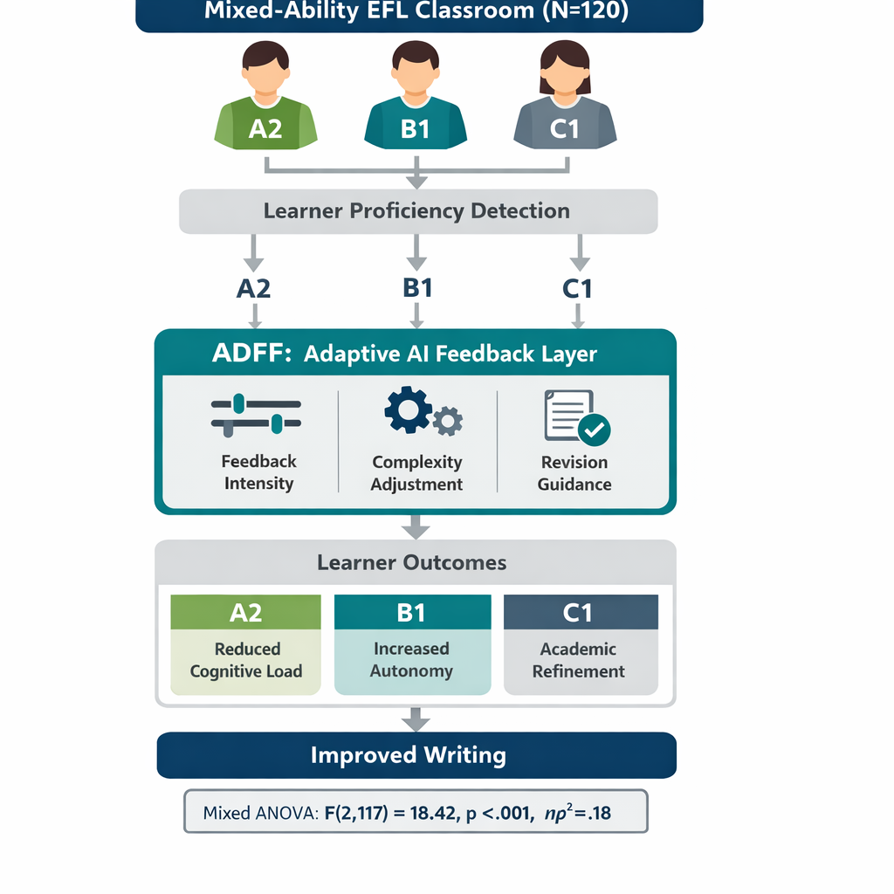
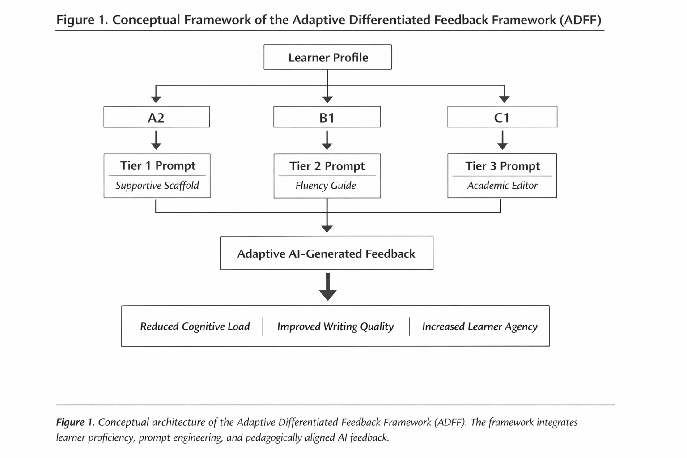
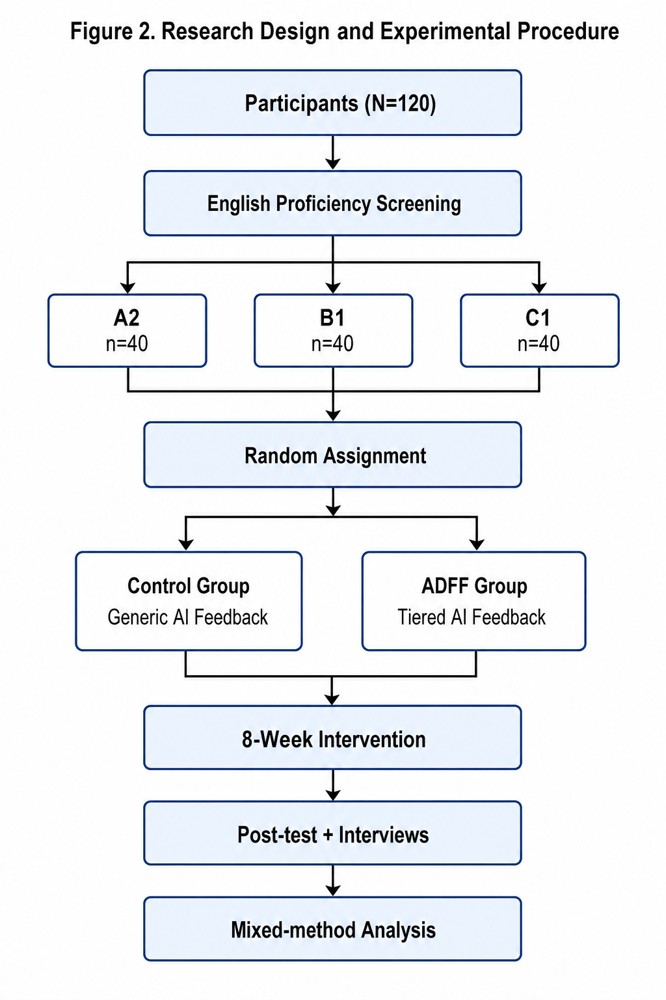
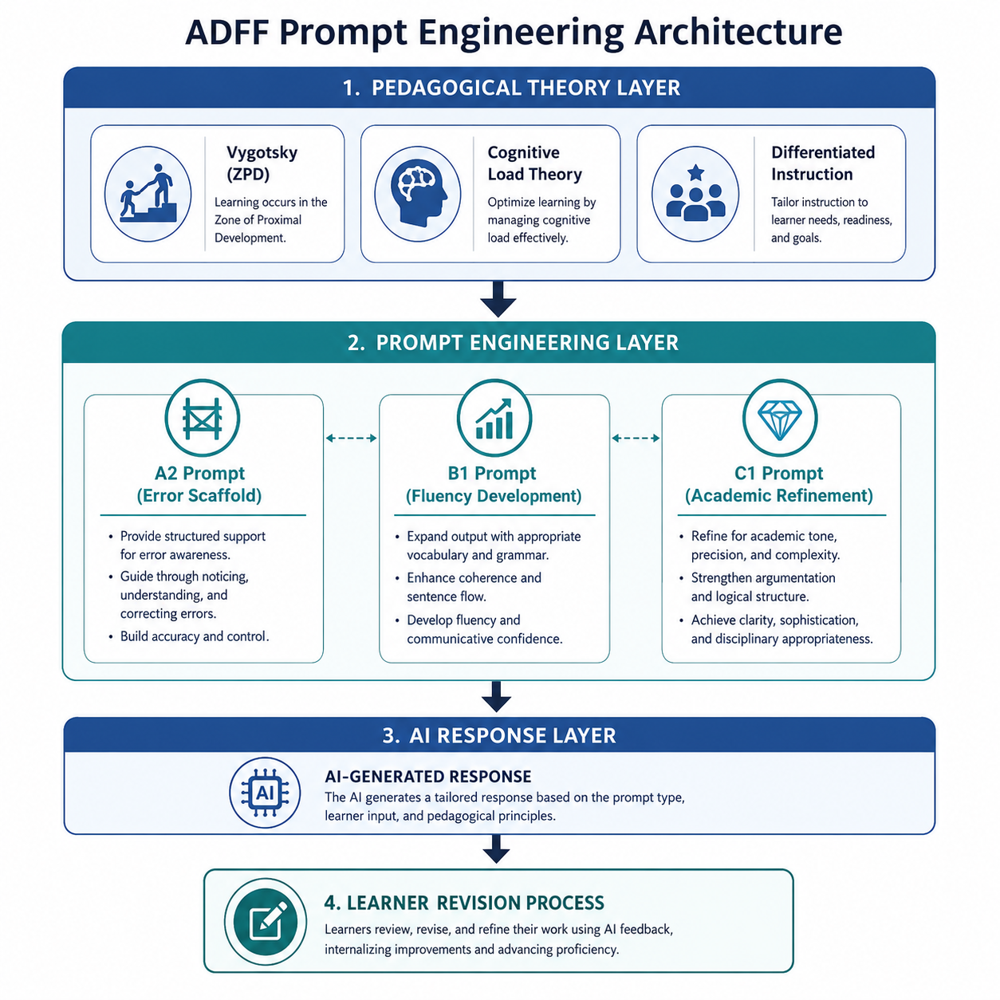
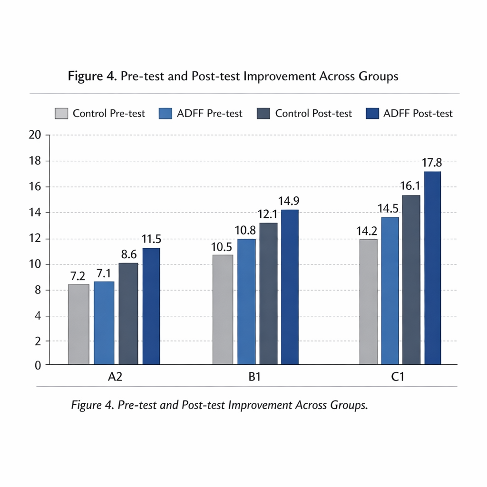
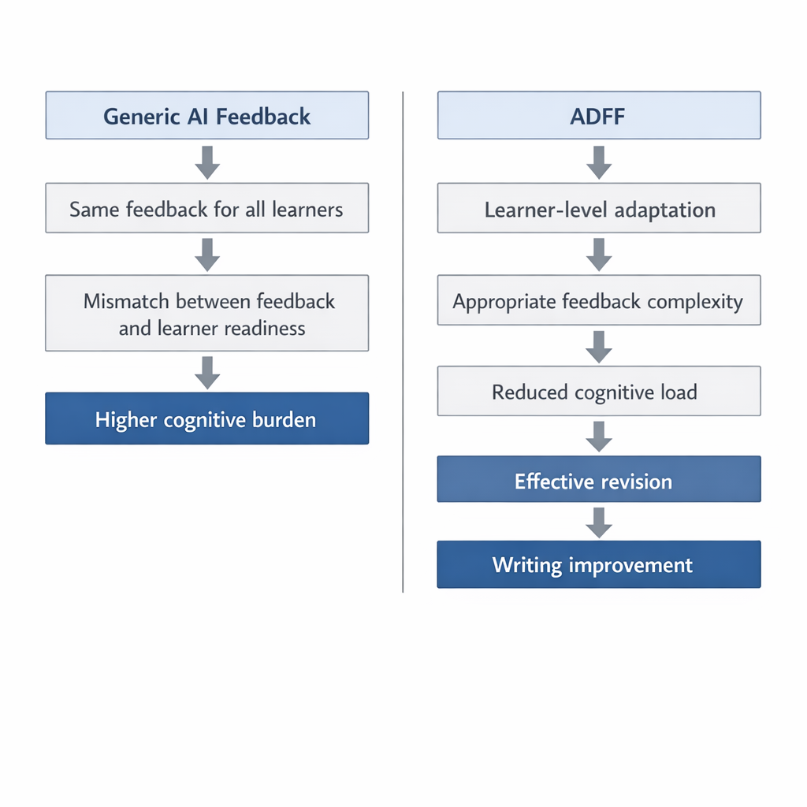

  # ADFF: Adaptive Differentiated Feedback Framework

  

<b>Graphic Abstract</b>

This repository contains the manuscript, figures, data package, and supplementary materials for the study:

**Adaptive Differentiated Feedback Framework (ADFF): Enhancing EFL Writing Development through Proficiency-Sensitive Generative AI Feedback**

---

## 📌 Citation & Digital Object Identifier (DOI)

To ensure transparency and reproducibility, the full research package—including datasets, prompt architectures, and analysis scripts—has been archived on Zenodo.

If you use this data or the ADFF framework in your research, please cite it using the following DOI:

**DOI:** [10.5281/zenodo.21805840](https://doi.org/10.5281/zenodo.21805840)

---

## 📊 Key Results

| Outcome | Result |
|---|---|
| Main effect of feedback condition | Significant |
| Interaction: feedback method × proficiency level | F(2,117) = 18.42, p < .001, ηp² = .18 |
| Post-test improvement pattern | Largest gains in A2 learners |
| Overall conclusion | ADFF outperformed generic AI feedback in supporting writing development |

---

## 📖 Overview

The Adaptive Differentiated Feedback Framework (ADFF) is a proficiency-sensitive generative AI feedback model designed to align feedback complexity, explicitness, and pedagogical support with learners’ English proficiency levels (A2, B1, and C1).

This study employed a quasi-experimental mixed-methods design to compare adaptive AI-generated feedback with conventional non-differentiated AI feedback in EFL writing development.

---

## 🖼️ Figures

<table style="width:100%">
  <tr align="center">
    <td> <b>Figure 1.</b> Conceptual Framework</td>
    <td> <b>Figure 2.</b> Research Design</td>
  </tr>
  <tr align="center">
    <td> <b>Figure 3.</b> Prompt Engineering Architecture</td>
    <td> <b>Figure 4.</b> Statistical Results</td>
  </tr>
  <tr align="center">
    <td> <b>Figure 5.</b> Discussion Mechanism</td>
    <td> <b>Figure 6.</b> Graphic Abstract</td>
  </tr>
</table>

---

## 📁 Repository Contents

- `manuscript/` — LaTeX manuscript files and writing materials
- `Figures/` — Article figures, graphic abstract, and visual assets
- `data/` — Research data package and supporting files
- `code/` — Analysis scripts or reproducibility code
- `docs/` — Supplementary project documentation

---

## 🧪 Reproducibility Notes

- This repository is structured to support transparent and reproducible research.
- Data files are provided in cleaned and analysis-ready formats.
- Statistical reporting follows APA-style conventions.
- All resources are organized for academic archiving and open-science sharing.

---

## ✉️ Contact

**Pegah Merrikhi**  
Email: `Pegah.merrikhiii@gmail.com`

---

## ⚖️ License

See `LICENSE` for usage terms.
